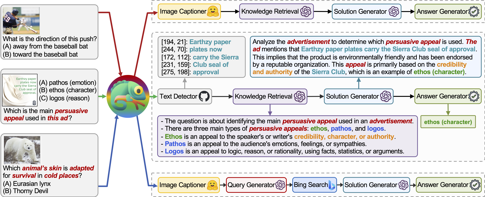
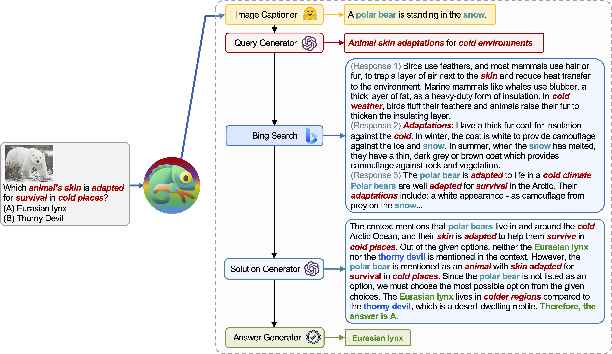
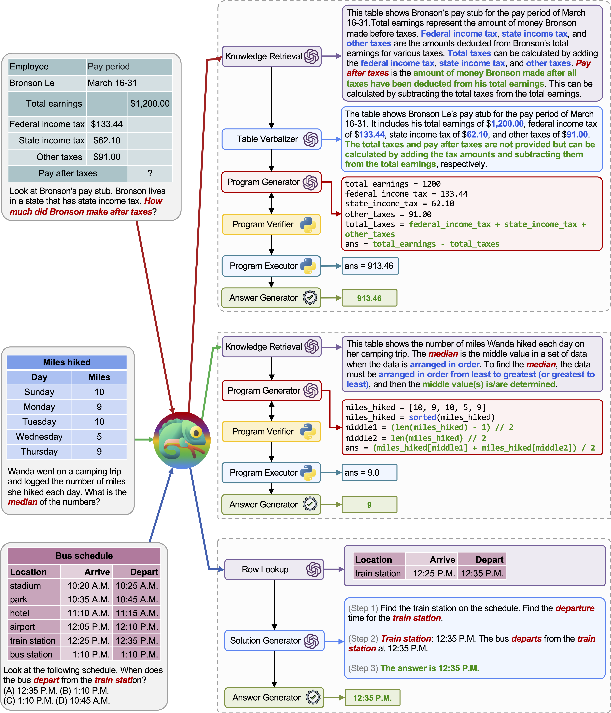

# :lizard: Chameleon: Plug-and-Play Compositional Reasoning with GPT-4

 
 
 
 
 


Code for the Paper "[Chameleon: Plug-and-Play Compositional Reasoning with Large Language Models](https://arxiv.org/abs/2304.09842)".

:bell: If you have any questions or suggestions, please don't hesitate to let us know. You can directly email [Pan Lu](https://lupantech.github.io/) using the email address lupantech@gmail.com, comment on the [Twitter](https://twitter.com/lupantech/status/1648879085115052033), or post an issue on this repository.


## 💥 News 💥

- **[2023.04.19]** Our paper is now available at https://arxiv.org/abs/2304.09842.
- **[2023.04.19]** Our project is now available at https://chameleon-llm.github.io/.


## :lizard: About Chameleon

**Chameleon** is a plug-and-play compositional reasoning framework that augments LLMs with various types of tools. **Chameleon** synthesizes programs to compose various tools, including LLM models, off-the-shelf vision models, web search engines, Python functions, and rule-based modules tailored to user interests. Built on top of an LLM as a natural language planner, **Chameleon** infers the appropriate sequence of tools to compose and execute in order to generate a final response. 



We showcase the adaptability and effectiveness of **Chameleon** on two tasks: [ScienceQA](https://scienceqa.github.io/) and [TabMWP](https://promptpg.github.io/). Notably, **Chameleon** with GPT-4 achieves an 86.54% accuracy on ScienceQA, significantly improving upon the best published few-shot model by 11.37%; using GPT-4 as the underlying LLM, Chameleon achieves a 17.8% increase over the state-of-the-art model, leading to a 98.78% overall accuracy on TabMWP. Further studies suggest that using GPT-4 as a planner exhibits more consistent and rational tool selection and is able to infer potential constraints given the instructions, compared to other LLMs like ChatGPT.

For more details, you can find our project page [here](https://chameleon-llm.github.io/) and our paper [here](https://arxiv.org/pdf/2304.09842.pdf).


## 🐙 Requirements

- [OpenAI API key](https://platform.openai.com/account/api-keys)
- [Bing Search API](https://www.microsoft.com/en-us/bing/apis/bing-web-search-api.) (If you want to enable the bing search module but the module is optional)

Install all required python dependencies:

```
python==3.8.10
huggingface-hub
numpy==1.23.2
openai==0.23.0
pandas==1.4.3
transformers==4.21.1
requests==2.28.1
```

Install all required python dependencies (you can skip this step if you have set up the dependencies before and the verisons are not strictly required):

```
pip install -r requirements.txt
```


## ⚠️ Configuration ⚠️

### OpenAI API Key

Obtain your OpenAI API key from: https://platform.openai.com/account/api-keys.

To use OpenAI API key for **Chameleon**, you **NEED** to have billing set up (AKA paid account).

You can set up paid account at https://platform.openai.com/account/billing/overview.

### Bing Search API Key (Optional)

Obtain your Bing Search API key from: https://www.microsoft.com/en-us/bing/apis/bing-web-search-api.

The Bing Search API key is **optional**. Failure to set up this key will lead to a slight performance drop on the ScienceQA task.


## 🤖 Run Chameleon on ScienceQA

Science Question Answering ([ScienceQA](https://scienceqa.github.io/)) is a multi-modal question-answering benchmark covering a wide range of scientific topics over diverse contexts. The ScienceQA dataset is provided in [`data/scienceqa`](https://github.com/lupantech/chameleon-llm/tree/main/data/scienceqa). For more details, you can explore the datatset and check out the [Explore](https://scienceqa.github.io/explore.html) page and [Visualize](https://scienceqa.github.io/visualize.html) page.

For the current version, the results for the `Image Captioner` and `Text Detector` are off-the-shelf and stored in `data/scienceqa/captions.json` and `data/scienceqa/ocrs.json`, respectively. The live calling these two modules are coming soon!

To run **Chameleon** (GPT-4):

```sh
cd run_scienceqa

python run.py \
--model chameleon \
--label chameleon_gpt4 \
--policy_engine gpt-4 \
--kr_engine gpt-4 \
--qg_engine gpt-4 \
--sg_engine gpt-4 \
--test_split test \
--test_number -1
```

It will generate the predictions and save the results at `results/scienceqa/chameleon_gpt4_test.json`,  `results/scienceqa/chameleon_gpt4_test_cache.jsonl`, and  `results/scienceqa/chameleon_gpt4_test_cache.json`.

We can get the accuracy metrics on average and across different question classes by running:

```sh
python evaluate.py \
--data_file ../data/scienceqa/problems.json \
--result_root ../results/scienceqa \
--result_files chameleon_chatgpt_test_cache.jsonl
```

To run **Chameleon** (ChatGPT):

```sh
python run.py \
--model chameleon \
--label chameleon_gpt4 \
--policy_engine gpt-3.5-turbo \
--kr_engine gpt-3.5-turbo \
--qg_engine gpt-3.5-turbo \
--sg_engine gpt-3.5-turbo \
--test_split test \
--test_number -1
```

To run CoT GPT-4:

```sh
python run.py \
--model cot \
--label cot_gpt4 \
--sg_engine gpt-4 \
--test_split test \
--test_number -1
```


## 🤖 Run Chameleon on TabMWP

The TabMWP dataset contains 38,431 tabular math word problems. Each question in TabMWP is aligned with a tabular context, which is presented as an image, semi-structured text, and a structured table. The TabMWP dataset is provided in [`data/tabmwp`](https://github.com/lupantech/PromptPG/blob/main/data/tabmwp). For more details, you can explore the datatset and check out the [Explore](https://promptpg.github.io/explore.html) page and [Visualize](https://promptpg.github.io/visualize.html) page.

To run **Chameleon** (GPT-4):

```sh
cd run_tabmwp

python run.py \
--model chameleon \
--label chameleon_gpt4 \
--test_split test \
--tl_engine gpt-4 \
--rl_engine gpt-4 \
--cl_engine gpt-4 \
--tv_engine gpt-4 \
--kr_engine gpt-4 \
--sg_engine gpt-4 \
--pg_engine gpt-4 \
--test_number -1 \
--rl_cell_threshold 18 \
--cl_cell_threshold 18
```

It will generate the predictions and save the results at `results/tabmwp/chameleon_gpt4_test.json`,  `results/tabmwp/chameleon_gpt4_test_cache.jsonl`, and  `results/tabmwp/chameleon_gpt4_test_cache.json`.

We can get the accuracy metrics on average and across different question classes by running:

```sh
python evaluate.py \
--data_file ../data/tabmwp/problems_test.json \
--result_root ../results/tabmwp \
--result_files chameleon_chatgpt_test_cache.jsonl
```

To run **Chameleon** (ChatGPT):

```sh
python run.py \
--model chameleon \
--label chameleon_chatgpt \
--test_split test \
--tl_engine gpt-3.5-turbo \
--rl_engine gpt-3.5-turbo \
--cl_engine gpt-3.5-turbo \
--tv_engine gpt-3.5-turbo \
--kr_engine gpt-3.5-turbo \
--sg_engine gpt-3.5-turbo \
--pg_engine gpt-3.5-turbo \
--test_number -1 \
--rl_cell_threshold 18 \
--cl_cell_threshold 18
```

To run CoT GPT-4:

```sh
python run.py \
--model cot \
--label cot_gpt4 \
--test_split test \
--sg_engine gpt-4 \
--test_number -1
```

To run PoT GPT-4:

```sh
python run.py \
--model pot \
--label pot_gpt4 \
--test_split test \
--pg_engine gpt-4 \
--test_number -1
```


## 😈 More Examples

More examples on the ScienceQA dataset:



More examples on the TabMWP dataset:




## :white_check_mark: Cite

If you find **Chameleon** useful for your your research and applications, please kindly cite using this BibTeX:

```latex
@article{lu2023chameleon,
  title={Chameleon: Plug-and-Play Compositional Reasoning with Large Language Models},
  author={Lu, Pan and Peng, Baolin and Cheng, Hao and Galley, Michel and Chang, Kai-Wei and Wu, Ying Nian and Zhu, Song-Chun and Gao, Jianfeng},
  journal={arXiv preprint arXiv:2304.09842},
  year={2023}
}
```
